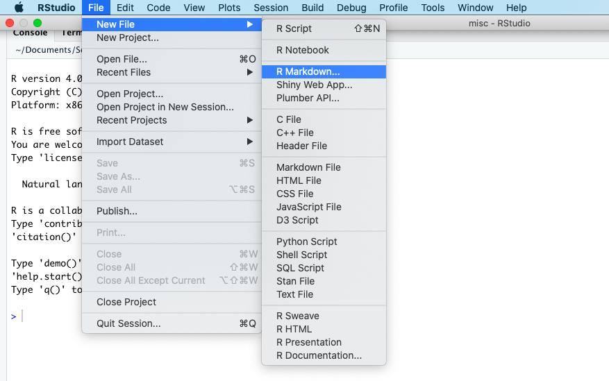
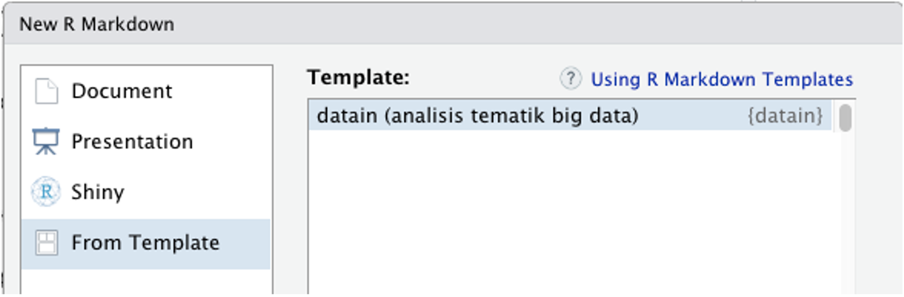

This repository contains the R markdown template for monthly bulletin of Thematic  Big Data Analysis published by Statistical Model Development Division in Statistics Indonesia. This is built by forking the repo of [`example-rmd-templates` by Dr. Michael Harper](https://github.com/dr-harper/example-rmd-templates) and also adpated from [`monash::memo` template by Rob J. Hyndman](https://github.com/numbats/monash).

**Prerequsuite: Familiarity with R and Rmarkdown**

## Installing the Templates

To use this template, you can install it first:

```
# install.packages("devtools")
devtools::install_github("Dewi-Amaliah/datain")
```

## Using the template 

After that, you can start by creating a new R markdown file. 

<br>



<br>

After that, select From Template and choose "datain (analisis tematik big data)".




