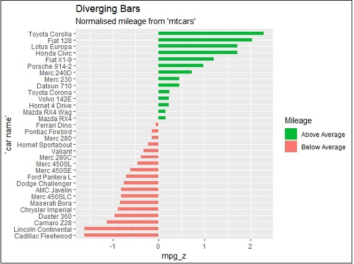

```{r setup, include = FALSE}
knitr::opts_chunk$set(echo = FALSE,
                      warning = FALSE,
                      message = FALSE,
                      fig.align = "center")
```

```{r pkg}
# load package yang akan dipakai di sini
# sebagai contoh, tidyverse
library(tidyverse)
# install.packages("patchwork")
library(patchwork)
```


# Section 1: Bullets and Numbering

Dalam membuat laporan dengan R markdown, anda dapat mengetik interpretasi dari analisis data seperti biasa, seperti yang dilakukan pada Ms.Word. Perbedaannya, anda juga dapat melakukan data pre-processing dan analisis data (membuat table dan plot) di sini.  

Untuk membuat poin-poin (numbering), dapat dilakukan dengan:

1. aaaaa
2. bbbbb

Sedangkan untuk poin-poin berupa bullets, dapat dilakukan dengan:

- aaaaa
- bbbbb

Intinya, bullets and numbering dapat dilakukan sama seperti di Word. 


# Section 2: Membuat Grafik


## a. Membuat grafik dengan R

Grafik dapat dibuat langsung di R markdown, dapat dilakukan dengan menggunakan ggplot2. 
`ggplot2` dapat dipelajari di [sini](https://r4ds.had.co.nz/data-visualisation.html) dan di [sini](https://r-graph-gallery.com).

Berikut adalah contoh pembuatan plot dengan menggunakan `ggplot2` pada `mtcars` data. Hal-hal yang perlu diperhatikan dalam menggunakan gambar adalah sebagai berikut:

- Untuk menambahkan tema ST pada grafik, tambahkan perintah `datain::st_theme` pada akhir code.
- Menambahkan caption secara otomatis pada gambar dapat dilakukan dengan menambahkan `fig.cap` pada code chunk.
- Anda juga dapat mengatur ukuran gambar dengan cara menambahkan perintah `out.width` pada code chunk.


```{r cars-plot, fig.cap = "Hubungan antara MPG dan HP.", out.width= "60%"}
ggplot(mtcars, aes(x = mpg, y = hp)) +
  geom_point() +
  # Menambahkan sumber gambar
  labs(caption = "Sumber: Henderson and Velleman (1981)") +
  # Menambahkan tema ST
  datain::st_theme()
```


## b. Mengimport grafik/gambar yang sudah ada


Apabila grafik/gambar tidak dibuat di R, anda dapat mengimportnya dengan cara berikut: 

```{r fig1, fig.cap= "Mileage per gallon by car brands", out.width= "60%"}

```


## c. Dua gambar side-by-side 


**Apabila gambar dibuat di R**

Apabila gambar dibuat di R, misalnya dengan menggunakan `ggplot2`, maka gambar bisa ditampilkan side-by-side dengan menggunakan package `patchwork`. Caranya adalah sebagai berikut: 

```{r mtcars-plot, fig.cap = "(a) Scatter plot dan (b) Histogram."}
gambar_1 <- ggplot(mtcars, aes(x = mpg, y = hp)) +
  geom_point() +
  ggtitle("(a)") +
  datain::st_theme()

gambar_2 <- ggplot(mtcars, aes(x = mpg)) +
  geom_histogram() +
  ggtitle("(b)") +
  labs(caption = "Sumber: Henderson and Velleman (1981)") +
  datain::st_theme() 

# menampilkan side by side dengan kode di bawah:
gambar_1 + gambar_2
```


**Apabila gambar adalah gambar yang diimport**

Apabila ingin menampilkan gambar side-by-side yang diimport, maka perintahnya adalah sebagai berikut, yaitu cukup mengganti ex-figure1.jpg dan ex-figure2.png dengan nama file gambar anda. Setelah itu berikan caption/keterangan pada masing-masing gambar tersebut.  

\begin{figure}
    \centering
    \subfigure[]{\includegraphics[width=0.49\textwidth]{ex-figure1.jpg}} 
    \subfigure[]{\includegraphics[width=0.49\textwidth]{ex-figure2.png}} 
    \caption{(a) keterangan gambar a. (b) Keterangan gambar b.}
    \label{fig:foobar}
\end{figure}


# Section 3: Referensi, Footnote, dan Font Style

**Cross-reference pada gambar**

Dalam interpretasi grafik, seringkali kita ingin merujuk pada gambar tertentu. Rujukan tersebut dapat dilakukan dengan mengetik perintah ini: Gambar \ref{fig:cars-plot}, dimana `cars-plot` adalah label dari chunk dimana gambar berada. Apabila ingin merujuk pada gambar side-by-side yang diimpor, maka rujukannya adalah: 
Gambar \ref{fig:foobar}. 


**Footnote**

Untuk footnote dapat dilakukan dengan perintah: \footnote{isi footnote}.


**Font Style**

\textbf{isi dengan text yang akan dicetak tebal} atau dengan memberikan dua tanda bintang di awal dan akhir **text yang akan ditebalkan** untuk text bold.

\textit{isi dengan text yang akan dicetak miring} atau dengan memberikan satu tanda bintang di awal dan akhir *text yang akan ditebalkan* untuk text italic.


